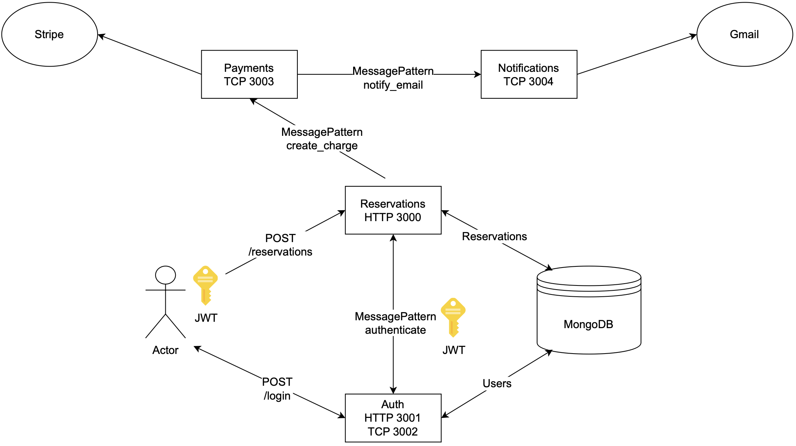

# NestJS microservices backend

<p align="center">
  
</p>

## Description

🏗️Simple microservices architecture CURD backend example made with NestJS and Typescript. 🚀Deployed using Kubernetes cluster in AWS and Google Cloud

## Installation

```bash
$ yarn install
```

## Running the app

```bash
# development
$ yarn run start

# watch mode
$ yarn run start:dev

# production mode
$ yarn run start:prod
```

## Test

```bash
# unit tests
$ yarn run test

# e2e tests
$ yarn run test:e2e

# test coverage
$ yarn run test:cov
```

## Stay in touch

- [David Zapico](https://davidzapico.com)
